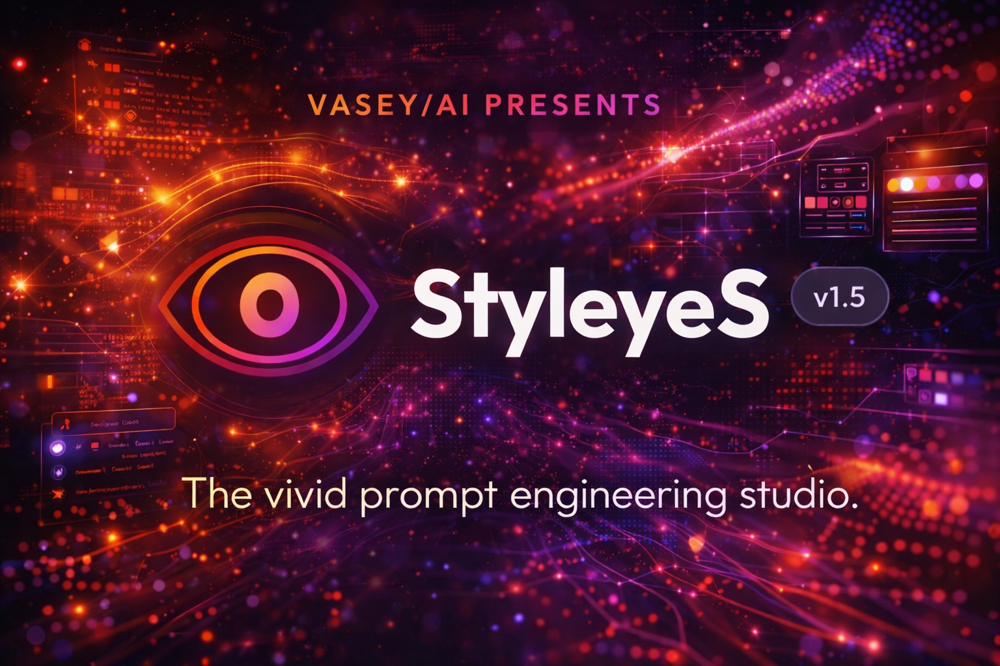

<div align="center">



# StyleyeS v1.5

**Vivid prompt engineering for AI image generation**

Craft rich, descriptive prompts for AI image generators with curated art styles, lighting controls, and intelligent prompt optimization.

[](https://github.com/SeanVasey/StyleyeS)
[](LICENSE)
[](manifest.json)

[Features](#-features) • [Getting Started](#-getting-started) • [Usage](#-usage) • [Project Structure](#-project-structure) • [Contributing](#-contributing)

</div>

---

## ✨ Features

- **🤖 Multi-Model Support** - Optimized prompts for GPT-Image 1.5, Midjourney, FLUX, Stable Diffusion, Leonardo AI, Qwen, and Nano Banana Pro
- **🎨 60+ Curated Styles** - Professional art styles across 8 categories: Photo, Cinematic, Art, Digital, Mood, Texture, Color, Era
- **💡 Lighting Controls** - White balance, anti-cast, and professional lighting setups (Softbox, Rembrandt, Rim Light, HMI, etc.)
- **🥞 Recipe Stack System** - Combine up to 5 art styles and 3 lighting controls with adjustable intensity weights (1-10)
- **📐 Aspect Ratio Picker** - Visual ratio selection: 21:9 Cinema, 16:9 Wide, 3:2 Photo, 1:1 Square, 2:3 Portrait, 4:5 Social, 9:16 Story
- **🖼️ Dual Input Modes** - Text descriptions or image reference uploads
- **📜 Prompt History** - Auto-save copied prompts with timestamps and quick recall
- **⭐ Favorites System** - Star your favorite styles for instant access
- **📤 Export/Import** - Backup and restore settings, favorites, and history as JSON
- **🔄 Offline Support** - Full PWA functionality with service worker caching
- **📱 iOS Optimized** - Native-feeling experience on iPhone/iPad with standalone mode
- **⚡ No Dependencies** - Pure vanilla JavaScript, no frameworks or build process
- **🎯 Smart Prompt Generation** - Model-specific formatting and optimization

## 📁 Project Structure

```
StyleyeS/
├── index.html              # Main application entry point
├── manifest.json           # PWA manifest for installable app
├── sw.js                   # Service worker for offline support
├── css/
│   ├── variables.css       # Design tokens & CSS custom properties
│   ├── base.css            # Reset, typography, form elements
│   ├── components.css      # UI components (cards, buttons, modals)
│   ├── layout.css          # Page structure & responsive grid
│   └── animations.css      # Keyframes & motion effects
├── js/
│   ├── config.js           # App configuration & model settings
│   ├── data.js             # Style & control definitions (60+ styles)
│   ├── state.js            # State management & localStorage
│   ├── ui.js               # DOM rendering & updates
│   ├── handlers.js         # Event binding & user interactions
│   └── app.js              # Application initialization
├── icons/
│   ├── favicon.svg         # Vector favicon
│   ├── icon-*.png          # PWA icons (72px - 512px)
│   ├── icon-maskable-*.png # Maskable icons for Android
│   └── apple-touch-icon-*.png # iOS home screen icons
└── images/
    ├── styleyes-banner.png # Repository banner image
    └── styleyes-cover.png  # Repository cover image
```

## 🚀 Getting Started

StyleyeS is a modern Progressive Web App that works seamlessly across desktop and mobile devices.

### Quick Start

**Desktop:**
```bash
# Clone the repository
git clone https://github.com/SeanVasey/StyleyeS.git
cd StyleyeS

# Open in browser (macOS/Linux)
open index.html

# Or on Windows
start index.html
```

Or simply **double-click** `index.html` to launch instantly.

### Progressive Web App Installation

**iOS (iPhone/iPad):**
1. Open StyleyeS in Safari
2. Tap the Share button
3. Select "Add to Home Screen"
4. Launch from home screen for full-screen experience

**Android:**
1. Open StyleyeS in Chrome
2. Tap the three-dot menu
3. Select "Install app" or "Add to Home screen"
4. Launch from app drawer

**Desktop (Chrome/Edge):**
1. Click the install icon in the address bar
2. Or use Menu → Install StyleyeS
3. Launch as standalone app

### Web Deployment

Deploy to any static hosting platform:
- **Netlify:** Drag & drop the folder
- **Vercel:** Connect GitHub repo
- **GitHub Pages:** Enable in repository settings
- **Cloudflare Pages:** Connect and deploy

No build process required - it's ready to deploy as-is!

## 💡 Usage

### Basic Workflow

1. **Enter a Subject** - Describe what you want to generate (e.g., "A lone astronaut on Mars")
2. **Select Target Model** - Choose your AI image generator from the dropdown
3. **Choose Aspect Ratio** - Pick the format for your image (Cinema, Portrait, Square, etc.)
4. **Build Your Recipe** - Tap art styles and lighting controls to add them to your stack
5. **Adjust Weights** - Fine-tune style intensity (1-10) and lighting intensity (1-10)
6. **Copy Prompt** - Click copy and paste into your AI tool

### Input Modes

**Text Mode (Default):**
- Enter descriptive text about your desired image
- Supports natural language descriptions
- Works with all AI models

**Image Mode:**
- Upload or drag & drop a reference image
- Model-specific image handling (Leonardo supports img2img workflows)
- Visual reference combined with style stack

### Art Style Categories

**📸 Photo** (10 styles)
- Raw Realism, Studio Portrait, Street Documentary, Editorial Fashion
- Macro Detail, Landscape Epic, Product Commercial, Food Culinary
- Architecture, Wildlife Nature

**🎬 Cinematic** (8 styles)
- Blockbuster Epic, Film Noir, Sci-Fi Dystopia, Wes Anderson
- Horror Suspense, Period Drama, Indie Film, Action Thriller

**🖼️ Art** (10 styles)
- Oil Painting, Watercolor, Art Nouveau, Impressionist, Surrealist
- Pop Art, Ukiyo-e, Renaissance, Expressionist, Baroque

**💻 Digital** (8 styles)
- Anime Cel, 3D Render, Pixel Art, Glitch Art
- Vector Minimal, Vaporwave, Isometric, Concept Art

**🌅 Mood** (6 styles)
- Golden Hour, Neon Noir, Ethereal Dream
- Dark Brooding, Misty Melancholy, Vibrant Energy

**🎞️ Texture** (4 styles)
- Heavy Film Grain, Matte Editorial, Crisp Clarity, Soft Diffusion

**🎨 Color** (6 styles)
- Monochrome Drama, Cross Process, Desaturated Cine
- Hyper Saturated, Pastel Soft, Earth Tones

**⏰ Era** (6 styles)
- 1950s Americana, 1970s Analog, 1980s Synthwave
- 1990s Grunge, Y2K Futurism, Victorian Gothic

### Lighting & White Balance Controls

**White Balance:**
- Neutral 5600K - Accurate color, true whites
- Cool 6500K - Daylight balance, reduced warm cast
- Warm 3200K - Tungsten balance, cozy warm highlights
- Magenta Tint - Counter green cast, neutral midtones

**Anti-Cast:**
- No Yellow Cast - Remove sepia/yellow tint
- No Green Cast - Clean neutrals, true skin tones

**Lighting Setups:**
- Overcast - Soft diffuse light, gentle shadows
- Softbox - Studio key light, controlled shadows
- North Window - Natural daylight, gentle falloff
- HMI Daylight - Clean white highlights, 5600K
- Rembrandt - Chiaroscuro, triangle of light
- Rim Light - Backlight, silhouette edge separation

### Recipe Stack Management

- **Add Styles:** Tap any style card to add to your recipe (max 5)
- **Add Lighting:** Switch to Lighting & WB tab and tap controls (max 3)
- **Remove Items:** Click the ✕ on any stacked item
- **Adjust Weights:** Use sliders to control intensity
  - Style Weight: 1 (subtle) to 10 (dominant)
  - Lighting Weight: 1 (hint) to 10 (pronounced)
- **Stack Counter:** Shows current items (e.g., "5 / 8" = 5 total, max 8)

### Model-Specific Outputs

**GPT-Image 1.5:**
- Natural language format
- Comma-separated descriptors
- Emphasis on key elements

**Midjourney:**
- CLI-style parameters
- Includes `--ar` aspect ratio
- Optimized for v5/v6

**FLUX:**
- Raw style formatting
- Direct concatenation
- Minimal punctuation

**Stable Diffusion:**
- Quality-focused keywords
- Emphasis markers
- Compatible with AUTOMATIC1111/ComfyUI

**Leonardo AI:**
- Image-to-image workflow support
- Reference image integration
- Preset-compatible formatting

**Qwen:**
- Clean descriptive prompts
- Structured formatting
- Natural phrasing

**Nano Banana Pro:**
- Detailed pro-quality output
- Comprehensive descriptors
- Production-ready prompts

### Advanced Features

**Favorites Management:**
1. Click ⭐ on any style card to favorite
2. Access favorites via "⭐ Favorites" button
3. Quick filter to show only starred styles

**Prompt History:**
1. Every copied prompt is auto-saved
2. Click "📜 History" to view past prompts
3. Click any history item to restore it

**Export/Import:**
1. Export: Saves settings, favorites, and history as JSON
2. Import: Restore from previously exported file
3. Great for backup or transferring between devices

## 🛠️ Technical Details

### Architecture

StyleyeS uses a **modular vanilla JavaScript architecture** with clear separation of concerns:

- **config.js** - Application configuration and model-specific settings
- **data.js** - Static data definitions (60+ styles, lighting controls)
- **state.js** - Centralized state management with localStorage persistence
- **ui.js** - Pure DOM rendering functions
- **handlers.js** - Event delegation and user interaction handling
- **app.js** - Application initialization and service worker registration

### Design Principles

- ✅ **No Build Process** - Drop anywhere, works immediately
- ✅ **Zero Dependencies** - Pure vanilla JavaScript, no npm packages
- ✅ **Mobile-First** - Responsive design with breakpoints at 500px, 768px, 1024px, 1440px
- ✅ **Progressive Enhancement** - Works without JavaScript for core content
- ✅ **Offline Capable** - Service worker caches all assets
- ✅ **Accessibility First** - Reduced motion support, focus-visible states, semantic HTML
- ✅ **Performance Optimized** - Minimal DOM manipulation, efficient state updates

### Browser Support

| Browser | Minimum Version |
|---------|----------------|
| Chrome/Edge | 88+ |
| Safari | 14+ |
| Firefox | 85+ |
| iOS Safari | 14+ |
| Android Chrome | 88+ |

### PWA Features

- **Manifest** - Installable app with custom icons and theme
- **Service Worker** - Offline caching of all assets
- **iOS Standalone** - Full-screen mode on iOS devices
- **Splash Screens** - Custom splash screens for various iPhone models
- **Shortcuts** - Quick actions for "New Prompt" and "History"
- **Screenshots** - App store-ready screenshots for wide and narrow displays

### State Persistence

All user data is stored locally using `localStorage`:
- **Favorites** - Starred styles persist across sessions
- **History** - Last 50 copied prompts with timestamps
- **Preferences** - Model selection, aspect ratio, weights
- **Recipe Stack** - Current style and lighting selections

No server communication - all data stays on your device.

## 🎨 Features in Detail

### Smart Prompt Generation

Each AI model receives optimized prompts in its preferred format:

**Example Input:**
- Subject: "A cyberpunk street at night"
- Styles: Film Noir, Neon Noir
- Lighting: Rim Light
- Aspect Ratio: 16:9

**Midjourney Output:**
```
/imagine A cyberpunk street at night, film noir, high contrast, dramatic shadows, neon noir, neon reflections, cyberpunk, rim lighting, backlight --ar 16:9
```

**GPT-Image Output:**
```
A cyberpunk street at night with a film noir aesthetic featuring high contrast and dramatic shadows, combined with neon noir vibes including neon reflections and cyberpunk elements, enhanced by rim lighting and backlight effects.
```

### Recipe Stack Intelligence

- **Weight Calculation** - Higher weights prioritize style tags in output
- **Deduplication** - Removes redundant tags across multiple styles
- **Model Adaptation** - Formats tags appropriately for each AI model
- **Aspect Ratio Integration** - Seamlessly adds ratio parameters where supported

### Responsive Design

**Mobile (< 768px):**
- Single column layout
- Touch-optimized buttons (min 44px)
- Swipe-friendly style grid
- Bottom-anchored actions

**Tablet (768px - 1024px):**
- Two-column style grid
- Optimized spacing
- Comfortable touch targets

**Desktop (> 1024px):**
- Three-column style grid
- Hover states
- Keyboard navigation support

## 🤝 Contributing

Contributions are welcome! Please ensure:

1. **Maintain Zero Dependencies** - Keep vanilla JavaScript, no frameworks
2. **Follow Modular Architecture** - Separate concerns across config, data, state, UI, handlers
3. **Test Across Devices** - Verify mobile, tablet, and desktop responsiveness
4. **Preserve PWA Functionality** - Ensure offline support continues working
5. **Document Changes** - Update README and inline comments
6. **Match Code Style** - Follow existing conventions and formatting

### Adding New Styles

Edit `js/data.js` and add to the `styles` array:

```javascript
{
  id: 'unique-id',
  name: 'Display Name',
  category: 'Photo|Cinematic|Art|Digital|Mood|Texture|Color|Era',
  tags: ['tag1', 'tag2', 'tag3', 'tag4', 'tag5', 'tag6']
}
```

### Adding New AI Models

Edit `js/config.js` and add to the `models` object:

```javascript
'model-key': {
  name: 'Model Display Name',
  imageMode: true|false, // Supports image input
  format: function(subject, tags, aspectRatio) {
    // Return formatted prompt string
  }
}
```

## 📄 License

Apache 2.0 License - see [LICENSE](LICENSE) file for details.

## 🙏 Acknowledgments

- **Design** - Modern glassmorphism UI with gradient accents
- **Fonts** - [Google Fonts](https://fonts.google.com/) (Outfit, JetBrains Mono)
- **Icons** - Custom SVG logo and UI icons
- **Style Curation** - Professional photography and cinematography techniques
- **PWA Implementation** - Modern web standards for offline-first experience

---

<div align="center">

**Built with ❤️ by [VASEY/AI](https://vasey.ai)**

[⭐ Star on GitHub](https://github.com/SeanVasey/StyleyeS) • [🐛 Report Bug](https://github.com/SeanVasey/StyleyeS/issues) • [💡 Request Feature](https://github.com/SeanVasey/StyleyeS/issues)

</div>
