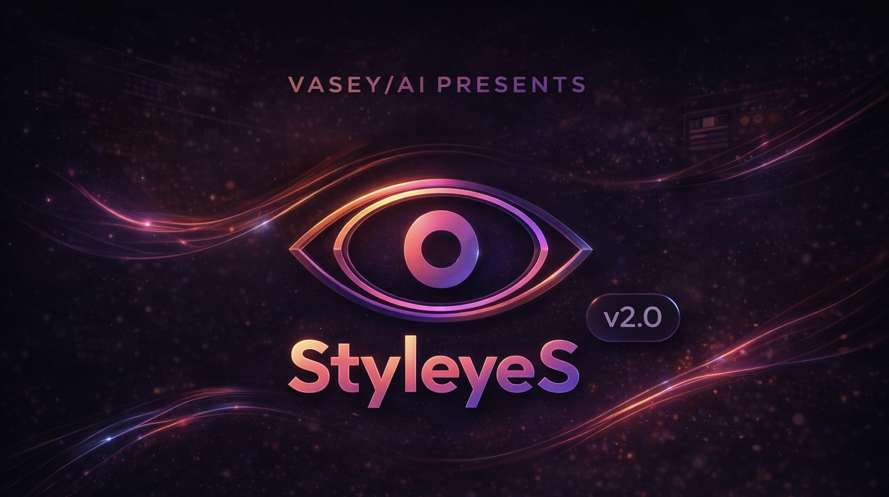

<div align="center">



# StyleyeS v2.1.1

**Vivid prompt engineering for AI image generation**

Craft rich, descriptive prompts for AI image generators with curated art styles, lighting controls, and intelligent prompt optimization.

[](https://github.com/SeanVasey/StyleyeS/actions/workflows/ci.yml)
[](https://seanvasey.github.io/StyleyeS)
[](https://github.com/SeanVasey/StyleyeS/actions/workflows/deploy-vercel.yml)
[](CHANGELOG.md)
[](LICENSE)
[](manifest.json)
[](package.json)

**[Live Demo](https://seanvasey.github.io/StyleyeS)**

[Features](#-features) • [Getting Started](#-getting-started) • [Usage](#-usage) • [Architecture](#-technical-details) • [Contributing](#-contributing)

</div>

---

## ✨ Features

- **🤖 Multi-Model Support** - Optimized prompts for Nano Banana Pro, Midjourney, Seedream 4.5, GPT-Image-1.5, FLUX.2 Pro, Qwen-Image, Stable Diffusion, and Leonardo
- **🎨 70+ Curated Styles** - Professional art styles across 8 categories: Photo, Cinematic, Art, Digital, Mood, Texture, Color, Era
- **💡 Lighting Controls** - White balance, anti-cast, and professional lighting setups (Softbox, Rembrandt, Rim Light, HMI, etc.)
- **🥞 Recipe Stack System** - Combine up to 5 art styles and 3 lighting controls with adjustable intensity weights (1-10)
- **📐 Dynamic Aspect Ratio Slider** - Magnetized snap points with morphing previews, haptic ticks, and live ratio feedback
- **🖼️ Dual Input Modes** - Text descriptions or image reference uploads
- **📜 Prompt History** - Auto-save copied prompts with timestamps and quick recall
- **⭐ Favorites System** - Star your favorite styles for instant access
- **📤 Export/Import** - Backup and restore settings, favorites, and history as JSON
- **🔄 Offline Support** - Full PWA functionality with service worker caching
- **📱 iOS Optimized** - Native-feeling experience on iPhone/iPad with standalone mode
- **📱 Landscape-Ready Layout** - Mobile landscape safeguards keep controls centered and single-line
- **⚡ No Dependencies** - Pure vanilla JavaScript, no frameworks or build process
- **🎯 Smart Prompt Generation** - Model-specific formatting and optimization

## 🧱 Tech Stack

- **Frontend:** Vanilla JavaScript, HTML5, CSS3
- **UX/UI:** Custom component styling, responsive layout, CSS animations
- **PWA:** Service worker + Web App Manifest
- **Tooling:** Node.js for lightweight validation scripts

## 📁 Project Structure

```
StyleyeS/
├── .github/
│   └── workflows/
│       ├── ci.yml              # CI — validation on push/PR
│       ├── deploy-pages.yml    # Deploy to GitHub Pages on push to main
│       └── deploy-vercel.yml   # Deploy to Vercel (preview on PR, production on main)
├── .editorconfig           # Editor formatting defaults
├── .gitignore              # Git ignore rules
├── CLAUDE.md               # Claude Code project context
├── index.html              # Main application entry point
├── manifest.json           # PWA manifest for installable app
├── sw.js                   # Service worker for offline support
├── package.json            # Validation tooling and metadata
├── css/
│   ├── variables.css       # Design tokens & CSS custom properties
│   ├── base.css            # Reset, typography, form elements
│   ├── components.css      # UI components (cards, buttons, modals)
│   ├── layout.css          # Page structure & responsive grid
│   ├── responsive.css      # Mobile landscape overrides
│   └── animations.css      # Keyframes & motion effects
├── docs/
│   └── MANIFEST.md          # Artifact inventory
├── CHANGELOG.md            # Release history
├── CODE_OF_CONDUCT.md      # Community guidelines
├── LICENSE                 # Apache 2.0 license
├── SECURITY.md             # Vulnerability reporting
├── SECURITY_AUDIT.md       # Security audit notes
├── js/
│   ├── config.js           # App configuration & model settings
│   ├── data.js             # Style & control definitions (70+ styles)
│   ├── state.js            # State management & localStorage
│   ├── ui.js               # DOM rendering & updates
│   ├── handlers.js         # Event binding & user interactions
│   └── app.js              # Application initialization
├── icons/
│   ├── StyleyeS_icon_optimized.svg # Primary app icon (SVG)
│   ├── icon-*.png          # Legacy PNG icons (kept for compatibility)
│   ├── icon-maskable-*.png # Maskable icons for Android
│   ├── apple-touch-icon-*.png # iOS home screen icons
│   └── models/             # Model-specific icons (white-line SVGs)
│       ├── nano-banana-pro.svg
│       ├── midjourney.svg
│       ├── seedream-4.5.svg
│       ├── gpt-image-1.5.svg
│       ├── flux-2-pro.svg
│       ├── qwen-image.svg
│       ├── stable-diffusion.svg
│       └── leonardo.svg
├── scripts/
│   └── validate.js          # Repository validation checks
└── images/
    └── styleyes-hero-v2.png  # Repository hero image (v2.0)
```

## 🚀 Getting Started

StyleyeS is a modern Progressive Web App that works seamlessly across desktop and mobile devices.

### Quick Start

**Desktop:**
```bash
# Clone the repository
git clone https://github.com/SeanVasey/StyleyeS.git
cd StyleyeS

# Run validation checks
npm install
npm test

# Open in browser (macOS/Linux)
open index.html

# Or on Windows
start index.html
```

Or simply **double-click** `index.html` to launch instantly.

### Commands

```bash
# Install validation tooling (no production dependencies)
npm install

# Run repository validation checks (version sync, required files)
npm test

# Open the app locally
open index.html
```

> **Build:** No build step is required. StyleyeS ships as a static PWA.

### CI/CD Workflows

All workflows run validation (`npm test`) before deploying. Validation checks version consistency across `package.json`, `js/config.js`, `index.html`, and `README.md`, and verifies required files exist.

| Workflow | File | Trigger | Purpose |
|----------|------|---------|---------|
| CI | `ci.yml` | Push to `main`, all PRs | Version sync and file validation |
| GitHub Pages | `deploy-pages.yml` | Push to `main`, manual dispatch | Validate then deploy static files via `actions/deploy-pages@v4` |
| Vercel | `deploy-vercel.yml` | Push to `main`, all PRs | Preview deploys on PRs, production deploy on `main` push |

### Environment Variables

StyleyeS does not require any environment variables to run locally. Deployment workflows require the following GitHub repository secrets:

| Secret | Required By | Description |
|--------|-------------|-------------|
| `VERCEL_TOKEN` | `deploy-vercel.yml` | Vercel API token ([create here](https://vercel.com/account/tokens)) |
| `VERCEL_ORG_ID` | `deploy-vercel.yml` | Vercel org/team ID (from `.vercel/project.json` after `vercel link`) |
| `VERCEL_PROJECT_ID` | `deploy-vercel.yml` | Vercel project ID (from `.vercel/project.json` after `vercel link`) |

GitHub Pages deployment uses the built-in `GITHUB_TOKEN` and requires Pages to be enabled in repository settings with source set to **GitHub Actions**.

### Progressive Web App Installation

**iOS (iPhone/iPad):**
1. Open StyleyeS in Safari
2. Tap the Share button
3. Select "Add to Home Screen"
4. Launch from home screen for full-screen experience

**Android:**
1. Open StyleyeS in Chrome
2. Tap the three-dot menu
3. Select "Install app" or "Add to Home screen"
4. Launch from app drawer

**Desktop (Chrome/Edge):**
1. Click the install icon in the address bar
2. Or use Menu → Install StyleyeS
3. Launch as standalone app

### Web Deployment

StyleyeS is deployed automatically via GitHub Actions on every push to `main`.

**Active Deployments:**
- **GitHub Pages** — Automated via `deploy-pages.yml` on every push to `main`. Enable Pages in repo settings (Source: GitHub Actions).
- **Vercel** — Automated via `deploy-vercel.yml`. Preview deploys on PRs, production on `main`. Requires `VERCEL_TOKEN`, `VERCEL_ORG_ID`, and `VERCEL_PROJECT_ID` secrets (see [Environment Variables](#environment-variables) above).

**Manual Deployment:**
Deploy to any static hosting platform — no build step required:
- **Netlify:** Drag & drop the project folder
- **Cloudflare Pages:** Connect the repository and deploy

## 💡 Usage

### Basic Workflow

1. **Enter a Subject** - Describe what you want to generate (e.g., "A lone astronaut on Mars")
2. **Select Target Model** - Choose your AI image generator from the rich model cards
3. **Choose Aspect Ratio** - Use the category toggle + slider to pick the format (portrait, square, landscape)
4. **Build Your Recipe** - Tap art styles and lighting controls to add them to your stack
5. **Adjust Weights** - Fine-tune style intensity (1-10) and lighting intensity (1-10)
6. **Copy Prompt** - Click copy and paste into your AI tool

### Input Modes

**Text Mode (Default):**
- Enter descriptive text about your desired image
- Supports natural language descriptions
- Works with all AI models

**Image Mode:**
- Upload or drag & drop a reference image
- Model-specific image handling (Leonardo supports img2img workflows)
- Visual reference combined with style stack

### Art Style Categories

**📸 Photo** (10 styles)
- Raw Realism, Studio Portrait, Street Documentary, Editorial Fashion
- Macro Detail, Landscape Epic, Product Commercial, Food Culinary
- Architecture, Wildlife Nature

**🎬 Cinematic** (8 styles)
- Blockbuster Epic, Film Noir, Sci-Fi Dystopia, Wes Anderson
- Horror Suspense, Period Drama, Indie Film, Action Thriller

**🖼️ Art** (10 styles)
- Oil Painting, Watercolor, Art Nouveau, Impressionist, Surrealist
- Pop Art, Ukiyo-e, Renaissance, Expressionist, Baroque

**💻 Digital** (8 styles)
- Anime Cel, 3D Render, Pixel Art, Glitch Art
- Vector Minimal, Vaporwave, Isometric, Concept Art

**🌅 Mood** (6 styles)
- Golden Hour, Neon Noir, Ethereal Dream
- Dark Brooding, Misty Melancholy, Vibrant Energy

**🎞️ Texture** (4 styles)
- Heavy Film Grain, Matte Editorial, Crisp Clarity, Soft Diffusion

**🎨 Color** (6 styles)
- Monochrome Drama, Cross Process, Desaturated Cine
- Hyper Saturated, Pastel Soft, Earth Tones

**⏰ Era** (6 styles)
- 1950s Americana, 1970s Analog, 1980s Synthwave
- 1990s Grunge, Y2K Futurism, Victorian Gothic

### Lighting & White Balance Controls

**White Balance:**
- Neutral 5600K - Accurate color, true whites
- Cool 6500K - Daylight balance, reduced warm cast
- Warm 3200K - Tungsten balance, cozy warm highlights
- Magenta Tint - Counter green cast, neutral midtones

**Anti-Cast:**
- No Yellow Cast - Remove sepia/yellow tint
- No Green Cast - Clean neutrals, true skin tones

**Lighting Setups:**
- Overcast - Soft diffuse light, gentle shadows
- Softbox - Studio key light, controlled shadows
- North Window - Natural daylight, gentle falloff
- HMI Daylight - Clean white highlights, 5600K
- Rembrandt - Chiaroscuro, triangle of light
- Rim Light - Backlight, silhouette edge separation

### Recipe Stack Management

- **Add Styles:** Tap any style card to add to your recipe (max 5)
- **Add Lighting:** Switch to Lighting & WB tab and tap controls (max 3)
- **Remove Items:** Click the ✕ on any stacked item
- **Adjust Weights:** Use sliders to control intensity
  - Style Weight: 1 (subtle) to 10 (dominant)
  - Lighting Weight: 1 (hint) to 10 (pronounced)
- **Stack Counter:** Shows current items (e.g., "5 / 8" = 5 total, max 8)

### Model-Specific Outputs

**Nano Banana Pro:**
- CLI-style aspect ratio flags
- Emphasizes high-detail and production quality

**GPT-Image-1.5:**
- Natural language format
- Comma-separated descriptors
- Emphasis on key elements

**Midjourney:**
- CLI-style parameters
- Includes `--ar` aspect ratio
- Optimized for v5/v6

**FLUX.2 Pro:**
- Raw style formatting
- Direct concatenation
- Minimal punctuation

**Seedream 4.5:**
- Natural language formatting
- Reference fidelity and production-ready output focus

**Stable Diffusion:**
- Quality-focused keywords
- Emphasis markers
- Compatible with AUTOMATIC1111/ComfyUI

**Leonardo:**
- Image-to-image workflow support
- Reference image integration
- Preset-compatible formatting

**Qwen-Image:**
- Clean descriptive prompts
- Structured formatting
- Natural phrasing

### Advanced Features

**Favorites Management:**
1. Click ⭐ on any style card to favorite
2. Access favorites via "⭐ Favorites" button
3. Quick filter to show only starred styles

**Prompt History:**
1. Every copied prompt is auto-saved
2. Click "📜 History" to view past prompts
3. Click any history item to restore it

**Export/Import:**
1. Export: Saves settings, favorites, and history as JSON
2. Import: Restore from previously exported file
3. Great for backup or transferring between devices

## 🛠️ Technical Details

### Architecture

StyleyeS uses a **modular vanilla JavaScript architecture** with clear separation of concerns:

- **config.js** - Application configuration and model-specific settings
- **data.js** - Static data definitions (70+ styles, lighting controls)
- **state.js** - Centralized state management with localStorage persistence
- **ui.js** - Pure DOM rendering functions
- **handlers.js** - Event delegation and user interaction handling
- **app.js** - Application initialization and service worker registration

### Design Principles

- ✅ **No Build Process** - Drop anywhere, works immediately
- ✅ **Zero Dependencies** - Pure vanilla JavaScript, no npm packages
- ✅ **Mobile-First** - Responsive design with breakpoints at 500px, 768px, 1024px, 1440px
- ✅ **Progressive Enhancement** - Works without JavaScript for core content
- ✅ **Offline Capable** - Service worker caches all assets
- ✅ **Accessibility First** - Reduced motion support, focus-visible states, semantic HTML
- ✅ **Performance Optimized** - Minimal DOM manipulation, efficient state updates

### Browser Support

| Browser | Minimum Version |
|---------|----------------|
| Chrome/Edge | 88+ |
| Safari | 14+ |
| Firefox | 85+ |
| iOS Safari | 14+ |
| Android Chrome | 88+ |

### PWA Features

- **Manifest** - Installable app with custom icons and theme
- **Service Worker** - Offline caching with stale-while-revalidate strategy for same-origin assets, cache-first for fonts, network-first for external resources
- **Safe Area Support** - `viewport-fit=cover` with `env(safe-area-inset-*)` CSS variables ensure content is never clipped by notches, rounded corners, or dynamic islands while the background extends edge-to-edge
- **iOS Standalone** - Full-screen mode on iOS devices with `black-translucent` status bar
- **Splash Screens** - Custom splash screens for various iPhone models
- **Shortcuts** - Quick actions for "New Prompt" and "History"
- **Screenshots** - App store-ready screenshots for wide and narrow displays

### State Persistence

All user data is stored locally using `localStorage`:
- **Favorites** - Starred styles persist across sessions
- **History** - Last 50 copied prompts with timestamps
- **Preferences** - Model selection, aspect ratio, weights
- **Recipe Stack** - Current style and lighting selections

No server communication - all data stays on your device.

## 🎨 Features in Detail

### Smart Prompt Generation

Each AI model receives optimized prompts in its preferred format:

**Example Input:**
- Subject: "A cyberpunk street at night"
- Styles: Film Noir, Neon Noir
- Lighting: Rim Light
- Aspect Ratio: 16:9

**Midjourney Output:**
```
/imagine A cyberpunk street at night, film noir, high contrast, dramatic shadows, neon noir, neon reflections, cyberpunk, rim lighting, backlight --ar 16:9
```

**GPT-Image Output:**
```
A cyberpunk street at night with a film noir aesthetic featuring high contrast and dramatic shadows, combined with neon noir vibes including neon reflections and cyberpunk elements, enhanced by rim lighting and backlight effects.
```

### Recipe Stack Intelligence

- **Weight Calculation** - Higher weights prioritize style tags in output
- **Deduplication** - Removes redundant tags across multiple styles
- **Model Adaptation** - Formats tags appropriately for each AI model
- **Aspect Ratio Integration** - Seamlessly adds ratio parameters where supported

### Responsive Design

**Mobile (< 768px):**
- Single column layout
- Touch-optimized buttons (min 44px)
- Swipe-friendly style grid
- Bottom-anchored actions

**Tablet (768px - 1024px):**
- Two-column style grid
- Optimized spacing
- Comfortable touch targets

**Desktop (> 1024px):**
- Three-column style grid
- Hover states
- Keyboard navigation support

## 🤝 Contributing

Contributions are welcome! Please ensure:

1. **Maintain Zero Dependencies** - Keep vanilla JavaScript, no frameworks
2. **Follow Modular Architecture** - Separate concerns across config, data, state, UI, handlers
3. **Test Across Devices** - Verify mobile, tablet, and desktop responsiveness
4. **Preserve PWA Functionality** - Ensure offline support continues working
5. **Document Changes** - Update README and inline comments
6. **Match Code Style** - Follow existing conventions and formatting

### Adding New Styles

Edit `js/data.js` and add to the `styles` array:

```javascript
{
  id: 'unique-id',
  name: 'Display Name',
  category: 'Photo|Cinematic|Art|Digital|Mood|Texture|Color|Era',
  tags: ['tag1', 'tag2', 'tag3', 'tag4', 'tag5', 'tag6']
}
```

### Adding New AI Models

Edit `js/config.js` and add to the `models` object:

```javascript
'model-key': {
  name: 'Model Display Name',
  imageMode: true|false, // Supports image input
  format: function(subject, tags, aspectRatio) {
    // Return formatted prompt string
  }
}
```

## 📄 License

Apache 2.0 License - see [LICENSE](LICENSE) file for details.

## 🙏 Acknowledgments

- **Design** - Modern glassmorphism UI with gradient accents
- **Fonts** - [Google Fonts](https://fonts.google.com/) (Outfit, JetBrains Mono)
- **Icons** - Custom SVG logo and UI icons
- **Style Curation** - Professional photography and cinematography techniques
- **PWA Implementation** - Modern web standards for offline-first experience

---

<div align="center">

**Built with ❤️ by [VASEY/AI](https://vasey.ai)**

[⭐ Star on GitHub](https://github.com/SeanVasey/StyleyeS) • [🐛 Report Bug](https://github.com/SeanVasey/StyleyeS/issues) • [💡 Request Feature](https://github.com/SeanVasey/StyleyeS/issues)

</div>
